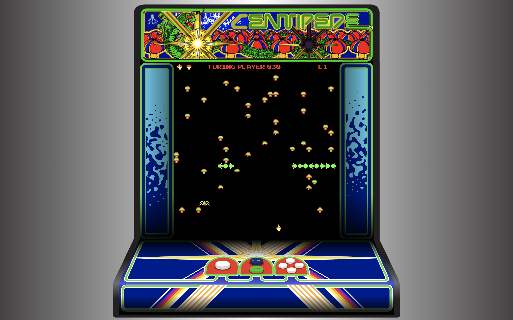

## Centipede

Centipede is a project built for Turing School of Software & Design by students Rob Morgan and Thomas Laird over a period of 10 days.  It's created in JS 2015, HTML Canvas, and is tested using Mocha/Chai.

We built it with the intention that it would look and play like the arcade classic.  The graphics are sprites, created in Adobe Illustrator.  The game cabinet and graphics are hand drawn in Illustrator, with the exception of the header which is a picture of a real Centipede game cabinet.

The primary challenge in building Centipede was collision detection.  Because there are so many moving things on the screen at once, there are constant collisions, all of which had to be carefully programmed and tweaked to get the values just right.

This was our first time using HTML Canvas and our first project using JS 2015 (ES6)

#### Feel free to give it a try and let us know what you think!

Live playable version: http://t-laird.com/Centipede

**********

#### Centipede components:

**Player - The player has as ship which can move around and shoot bullets at enemies.  Only 1 bullet can be on the screen at a time, regardless of where it is.  This mimics the behavior of the original game.**

**Mushrooms - 40 mushrooms are instantiated when the game begins and randomly placed.  Can be broken down and destroyed by 4 bullets from the player.**

**Centipede - Moves down the screen breaks apart into smaller centipedes when shot.  Each segment that is shot by the user becomes a mushroom.**

**Spider - Moves randomly across the screen either left to right, or right to left as well as randomly up and down.  Picks up some of the mushrooms it touches.  Is defeated by one bullet.**

**Flea - Moves from top to bottom of the screen, dropping mushrooms randomly on the way down.  Gets faster on higher levels.  Requires two bullets to be destroyed.**

